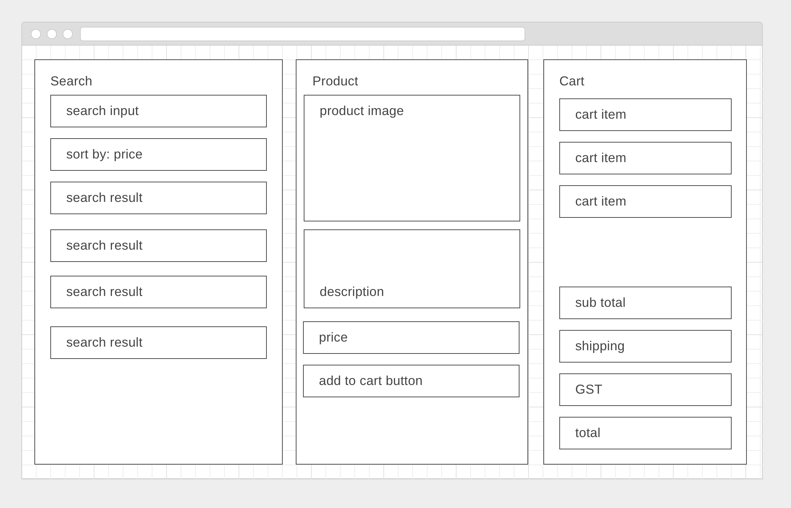

# shopping react app




Create a shopping app for grocery products.

There should be 3 main components:

1. A search component
  - search for a product and display the results (this should just get the entire list of products for now)
  - clicking on a product causes the product window to display/be filled
  
2. Product display component
  - displays information about the product (don't worry about the product image)
  - has a button to add to cart
  
3. Cart component
  - displays everything that was added to the cart
  - calculates subtotal, GST and shipping (flat $7)
  
Add bootstrap to your app if you like.

#### How to Start:
You should begin your app with one single working component- begin with the search component on the left. The express server in the starter code has a pre-maderoute for you to query the DB.

Use AJAX to make a query to this route and then use react to display the results. (see below for notes on react and `this` keyword in AJAX callbacks)

When you have a working component that displays the search results, you can begin on the second component. Refactor your code to store the list of results in the parent of the search component. Then use the search result the user selected to populate the second component.

You can then move on to the 3rd component to display the items the user has added to their cart from the 2nd component.

#### further
Add a carousel component to your app to display all the product images. Perhaps slick carousel npm library: https://github.com/akiran/react-slick
  
#### further
Add a sorting function to the search page. (just sort the results you currently have)

#### further
When the add to cart button is clicked again, add another item to the cart.

#### further
Let the user take things back out of the cart

#### further
Make each item in the cart a link. When the user clicks an item it opens in the product display tab.

#### further
Change the layout of the app to have only 2 columns. Add CSS to make the cart `position:absolute`. When something is added to the cart, make the cart display. Add a button inside the cart to hide it.

#### further
Paginate your search results.

#### further
Add more of the search result attributes into the product page.

#### further
Adjust the shipping cost according to the item added to the cart.

### `this` keyword with XML HttpRequest
With `XMLHttpRequest` we set the response text using `this` keyword.
```
function reqListener () {
  console.log(this.responseText);
}

var oReq = new XMLHttpRequest();
oReq.addEventListener("load", reqListener);
oReq.open("GET", "http://www.example.org/example.txt");
oReq.send();
```

If we want to set state in a react component method we need to have access to `this` keyowrd when it is the *react* `this`.

Just create a new variable that has the *react* `this` keyword value. 
```

  //copy the value of this in order to refer to it in another way.
  var reactThis = this;
  
  var reqListener = function(){
   console.log(this.responseText);
   
   //transform the response to real js objects
   const data = JSON.parse( this.responseText );
   
   // here, we can't do this.setState
   
   //refer to react state instead
   reactThis.setState({queryData:data});
  }

  var oReq = new XMLHttpRequest();
  oReq.addEventListener("load", reqListener);
  oReq.open("GET", "http://www.example.org/example.txt");
  oReq.send();

```

### Express Server
You are provided with an API route to use. Look at what it does here: https://github.com/wdi-sg/shopping-react/blob/master/src/server/controllers/products.js

You would make a request to the server with a url that looks like this: `http://localhost:3000/api/products`

## Usage

### Make sure you have nodemon installed globally
```
npm install -g nodemon
```

### Scripts
```bash
# run development mode
npm run dev
```

## License
MIT License. Free use and change.


